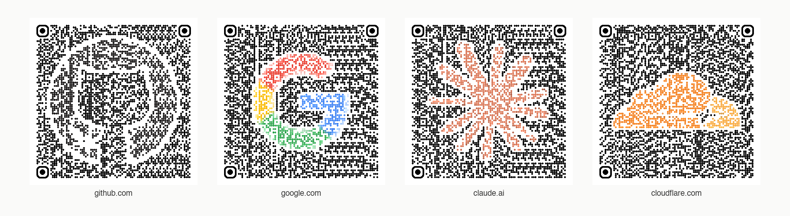
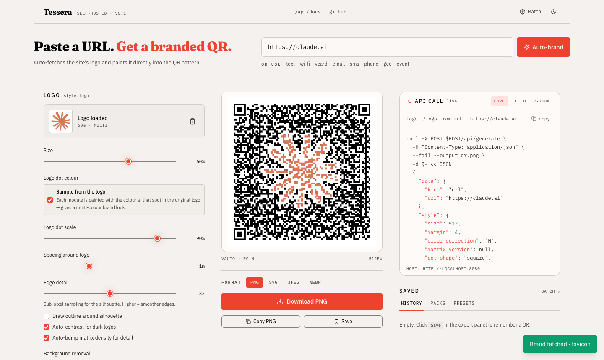
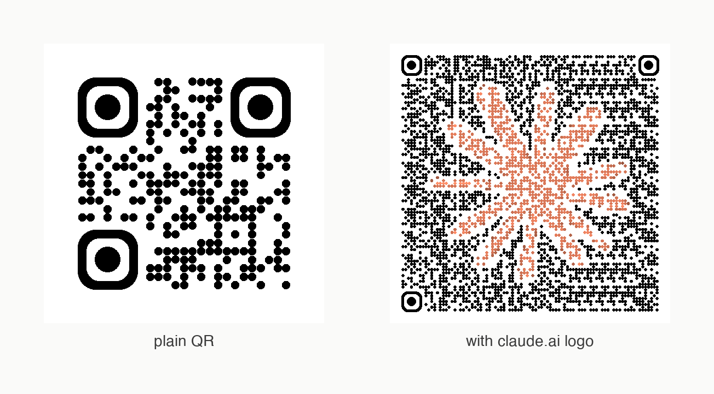

<div align="center">

# Tessera

**Branded QR codes where the dots themselves form the logo.**
Open-source, self-hosted, with a clean HTTP API.

[](LICENSE)
[](#quick-start)
[](#stack)
[](#stack)
[](#stack)



</div>

---

> *Tessera* (Latin) — a small mosaic tile. Each QR module is one tile in a larger image; together they spell out both the data and the brand.

Most "QR with a logo" tools paste a sticker on top, eating data through error-correction headroom. Tessera takes the brand mark, treats it as a **silhouette mask**, and paints every module that falls under it with colours sampled from the original logo. The dots themselves form the logo — same scannability, far more identity.

Paste a URL, click **Auto-brand**, ship it. Or skip the UI and call the HTTP API directly.

## Quick start

```bash
git clone https://github.com/nikiomori/tessera.git
cd tessera
docker compose up -d
# → http://localhost:8080
```

That's the whole install. Single container, ~295 MB, MIT-licensed.

<div align="center">

</div>

Prefer to call the API straight away?

```bash
curl -X POST http://localhost:8080/api/generate \
  -H 'Content-Type: application/json' \
  --output qr.png \
  -d '{
    "data":  {"kind":"url","url":"https://example.com"},
    "style": {"size": 600, "matrix_version": 12, "dot_scale": 0.9},
    "format": "png"
  }'
```

## How silhouette mode works



1. **Fetch the brand mark** — `POST /api/logo-from-url` walks `apple-touch-icon` → `<link rel="icon">` → `/favicon.ico` → `og:image` → Google's S2 favicon proxy and normalises whatever it finds to PNG.
2. **Strip the background** — colour-distance threshold (configurable) leaves only the brand mark.
3. **Project onto the QR matrix** — modules whose centre falls under the mark form the silhouette set; everything else stays in your chosen foreground.
4. **Sample colours per module** — each silhouette module inherits the colour of the corresponding pixel in the original logo, giving multi-colour brand marks like Google's "G" or Stack Overflow's chevron.
5. **Boost error correction** — the renderer raises EC level to **H** automatically when a logo is present, so up to ~30% of modules can be obscured and the code still scans cleanly.

A small padding ring around the silhouette is configurable; it's there because some scanners are picky around finder patterns.

## Features

- **Auto-brand from a URL** — one click, logo found and rendered.
- **9 data types** — URL · text · Wi-Fi · vCard · email · SMS · phone · geo · iCalendar event.
- **Rich styling** — five dot shapes, three corner-square shapes, two corner-dot shapes, solid colours, linear and radial gradients on both foreground and background, dot-scale slider for the "pixel art" look.
- **Live API panel** — copy/paste the exact `curl`, `fetch`, or `python requests` snippet for the configuration on screen.
- **Local persistence** — history (last 50 with thumbnails), named *packs* of QR configs (JSON import / export, ZIP export), 12 built-in style presets. No account, no tracking.
- **Batch generation** — paste a list of URLs, get a ZIP back.
- **Self-host** — one Docker container, healthcheck included.

## API

OpenAPI / Swagger UI at `http://localhost:8080/api/docs`.

| Endpoint | Description |
|---|---|
| `POST /api/generate` | Full JSON config → image bytes (PNG / SVG / JPEG / WebP). |
| `GET  /api/generate?data=...&fg=...` | Quick query-string form for `` embedding. |
| `POST /api/batch` | Array of configs → ZIP archive. |
| `POST /api/logo-from-url` | Auto-fetch a website's brand logo. |
| `GET  /api/presets` | Built-in style presets. |
| `GET  /api/health` | Liveness probe. |

### End-to-end example — auto-brand a real site

```bash
# 1. Fetch the logo
LOGO=$(curl -sX POST http://localhost:8080/api/logo-from-url \
  -H 'Content-Type: application/json' \
  -d '{"url":"https://github.com"}' \
  | jq -r .image_data_url)

# 2. Render the QR
curl -X POST http://localhost:8080/api/generate \
  -H 'Content-Type: application/json' \
  --output gh.png \
  -d "{
    \"data\":  {\"kind\":\"url\",\"url\":\"https://github.com\"},
    \"style\": {
      \"size\":           600,
      \"matrix_version\": 12,
      \"dot_scale\":      0.9,
      \"logo\": {
        \"image_data_url\":       \"$LOGO\",
        \"mode\":                 \"silhouette\",
        \"size_ratio\":           0.55,
        \"preserve_logo_colors\": true,
        \"bg_removal_method\":    \"color\",
        \"bg_removal_color\":     \"#FFFFFF\",
        \"bg_removal_threshold\": 18,
        \"space_around\":         1
      }
    },
    \"format\": \"png\"
  }"
```

### Quick embed (no logo)

```html

```

### Batch

```bash
curl -X POST http://localhost:8080/api/batch \
  -H 'Content-Type: application/json' \
  --output qrs.zip \
  -d '{
    "items": [
      {"name": "site",    "request": {"data": {"kind": "url",   "url": "https://example.com"}, "format": "png"}},
      {"name": "contact", "request": {"data": {"kind": "vcard", "first_name": "Ada"}, "format": "png"}}
    ]
  }'
```

## Configuration

All optional, all environment-driven.

| Variable | Default | Purpose |
|---|---|---|
| `TESSERA_API_KEY` | _unset_ | Require `X-API-Key` on every `/api/*` request. |
| `TESSERA_RATE_LIMIT_PER_MIN` | `0` | Per-IP rate limit. `0` (default) disables — fine for self-host. Set to a positive value for public deploys. |
| `TESSERA_CORS_ORIGINS` | `*` | Comma-separated allowed origins. |
| `TESSERA_MAX_BATCH_ITEMS` | `200` | Max items in a single `/api/batch`. |
| `TESSERA_STATIC_DIR` | _set in Docker_ | Path to the built frontend. Empty = API-only. |

A sample `.env.example` lives at the repo root.

## Stack

| Layer | Choice |
|---|---|
| Frontend | Vite + React 18 + TypeScript + Tailwind CSS v4 |
| Backend | FastAPI + Pydantic v2 + uvicorn |
| QR engine | [`segno`](https://github.com/heuer/segno) (matrix) + [Pillow](https://github.com/python-pillow/Pillow) (rendering, sampling, overlay) |
| Container | Multi-stage Dockerfile, ~295 MB final image |

## Local development

<details>
<summary>Two terminals — backend on :8000, frontend on :5173.</summary>

```bash
# Terminal 1 — backend
cd backend
python -m venv .venv && source .venv/bin/activate
pip install -r requirements-dev.txt
uvicorn app.main:app --reload

# Terminal 2 — frontend (proxies /api/* to :8000)
cd frontend
pnpm install
pnpm dev
```

Open `http://localhost:5173`.

**Quality gates:**

```bash
# backend
cd backend
ruff check . && ruff format --check . && mypy app && pytest -q   # 33 cases

# frontend
cd frontend
pnpm lint && pnpm typecheck && pnpm build
```

</details>

## Project structure

```
tessera/
├── frontend/                      # Vite + React + TS + Tailwind v4
│   └── src/
│       ├── components/            # Hero, ApiPanel, QRPreview, LogoUpload, …
│       ├── context/               # Provider components + context stores
│       ├── hooks/                 # useQR, useToaster, useQRImage, useTheme
│       ├── lib/                   # api.ts, defaults.ts, storage.ts, utils.ts
│       └── types/qr.ts            # TS mirrors of backend Pydantic models
├── backend/                       # FastAPI service
│   ├── app/
│   │   ├── api/                   # /api/generate, /batch, /logo-from-url, /presets
│   │   ├── core/                  # encoders, qr renderer, colours, logo, presets
│   │   ├── models/                # Pydantic v2 schemas (single source of truth)
│   │   ├── main.py                # FastAPI app + optional SPA static mount
│   │   └── settings.py            # env-driven config
│   └── tests/                     # 33 pytest cases
├── docs/assets/                   # README visuals
├── Dockerfile                     # multi-stage: node build → python runtime
├── docker-compose.yml
└── .github/workflows/ci.yml       # lint / typecheck / test / Docker build
```

## Roadmap

- Server-rendered live preview (offload generation entirely from the client).
- Multi-stop gradient editor (the API already supports up to 8 stops; UI shows two).
- Custom finder-pattern templates.
- Optional analytics / scan counters (opt-in, requires a redirect service).
- i18n.

## Contributing

PRs welcome — see [CONTRIBUTING.md](CONTRIBUTING.md). For larger changes, please open an issue first to discuss the direction.

## License

[MIT](LICENSE).

## Credits

QR matrix generation by [`segno`](https://github.com/heuer/segno) (BSD).
Image work by [Pillow](https://github.com/python-pillow/Pillow).
Icons from [lucide](https://lucide.dev) (ISC).
The "logo-as-dots" idea comes from [qr.mitbin.com](https://qr.mitbin.com/) — Tessera is an open, self-hostable take on the same concept, with a public HTTP API.
